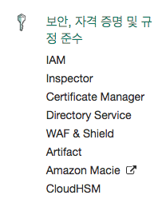
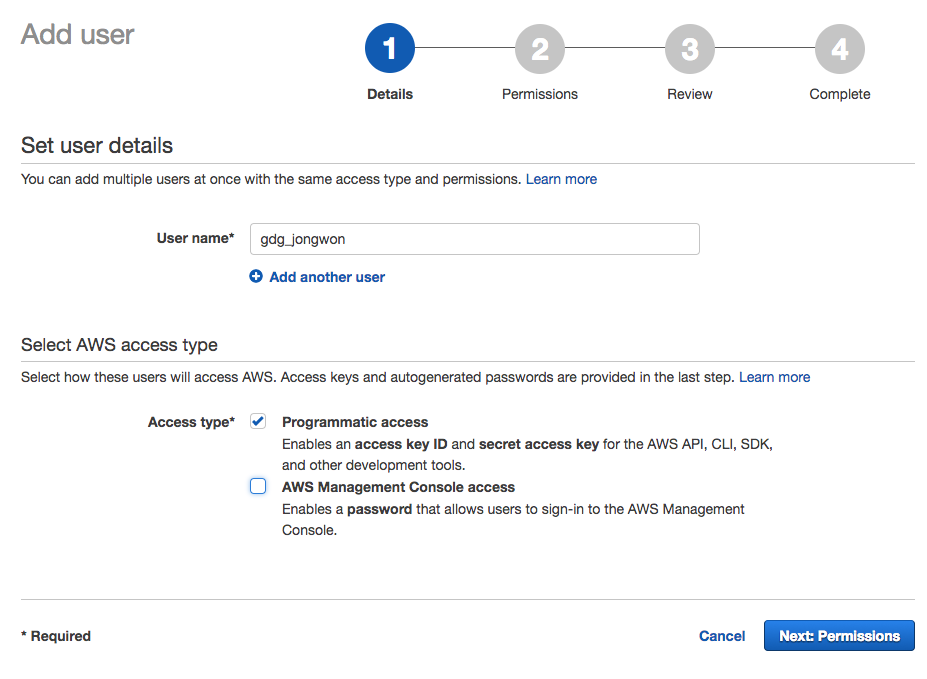
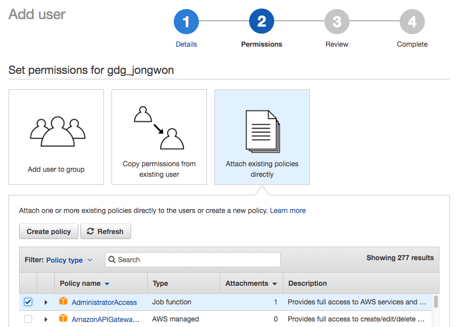
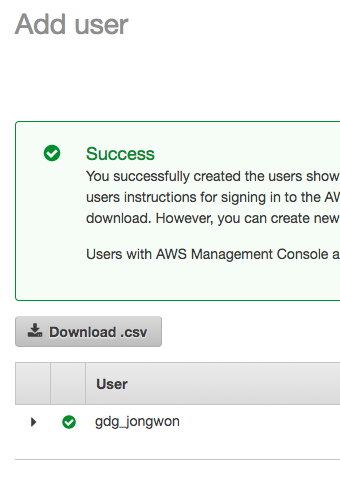
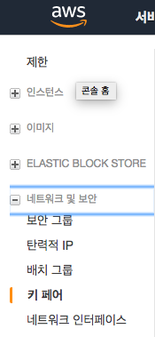
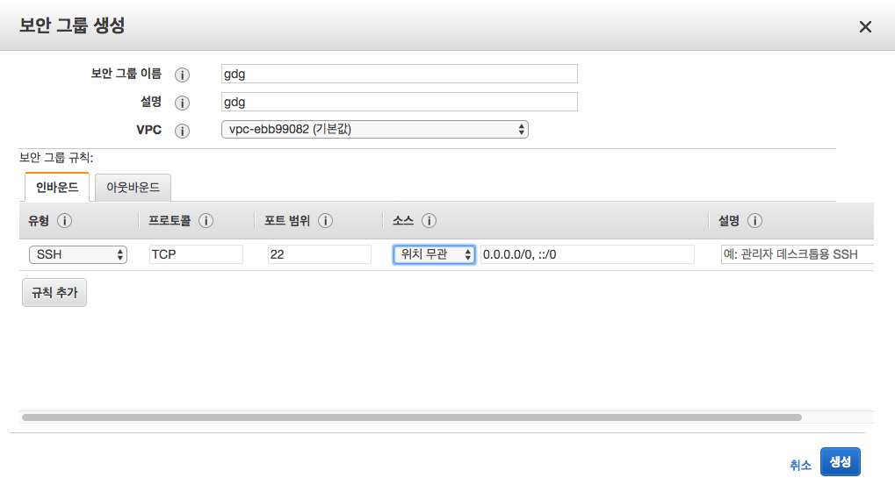
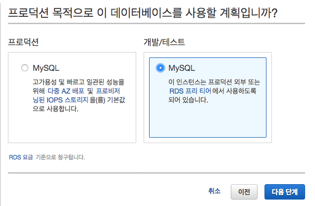
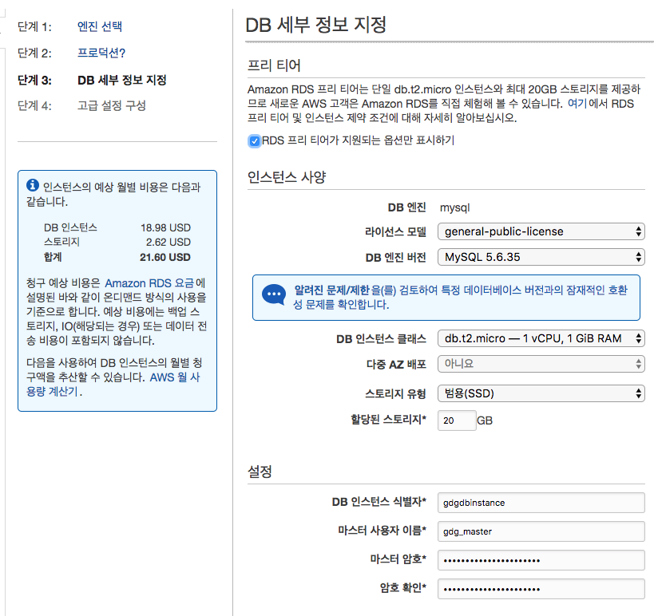
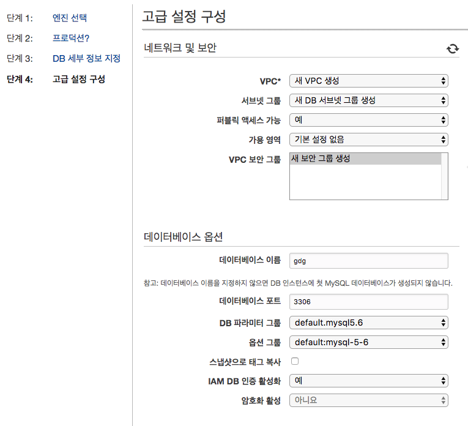
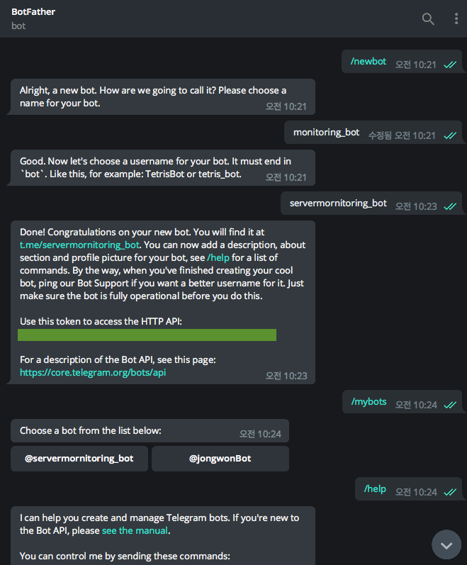

# GDGPython/MySQL을 활용한 대용량 데이터 수집

GDG DevFest 2017

## Prerequisite

# 주의! AWS 비용이 청구됩니다.

####  AWS IAM



`boto3`, `awscli` 패키지를 통해 인스턴스를 제어하기 위한 보안/자격증명 서비스입니다.



유저를 추가하고 `Programmatic access` 타입을 부여해서 SDK를 사용할 수 있도록 합니다.



여기서 권한을 제한할 수 있습니다 운영체제에서 유저 만드는 것과 흡사합니다.



주의! 이 웹 페이지를 나가면 키를 더 이상 받을 수 없습니다.
`Download.csv`를 저장하고 key id와 secret key를 복사합니다.

로컬 컴퓨터 또는 Central 인스턴스에서 다음 작업으로 인스턴스를 제어할 수 있습니다.

```
pip install awscli
aws configure
```

복사한 key id, secret key, region(Ex. ap-northeast-2), format(Ex. json)을 입력합니다.

`~/.aws/config`, `~/.aws/credentials` 경로에 저장되면 설정이 완료됩니다.

#### AWS EC2(Ubuntu AMI)

라이브러리를 통해 제어하는 인스턴스입니다.

EC2 서비스에는 [Instance Metadata and Userdata](http://docs.aws.amazon.com/AWSEC2/latest/UserGuide/ec2-instance-metadata.html)라는 특별한 데이터에 접근 및 설정이 가능합니다.

User data를 통해 인스턴스가 처음 시작된 직후 바로 동작하는 스크립트를 전달할 수 있으며 Meta data를 통해 스크립트에서 인스턴스에 대한 정보를 얻어낼 수 있습니다.

인스턴스를 생성하기위한 Keypair와 Security Group Id가 필요합니다.





방화벽과 비슷한 위 설정을 해주어야 내부 접근이 가능합니다.

우분투 16.04 LTS 이미지에서 테스트를 진행하였습니다.
~~셀레늄이 여기서 가장 잘 돌아갑니다~~


#### AWS RDS

MySQL을 사용했으나 Aurora, MariaDB를 사용하여도 무방합니다.

프리티어를 사용하는 데에 필요한 요소는 아래와 같습니다.





IAM 접근을 허용해야 `boto3` 라이브러리로 제어가 가능합니다.



Console 접속

```
mysql -u gdg_master -h <엔드포인트 주소> -P 3306 -p
```

#### Telegram Notification(Option)

텔레그램의 알림을 사용하실 수 있습니다.

Telegram에서 `@botfather`를 통해 봇을 생성합니다.



봇에 아무 메시지를 입력하면 최근 메시지 정보를 나타내는 `getUpdates` API를 요청해서 채팅방 ID를 알아낼 수 있습니다.

```
curl https://api.telegram.org/bot<token>/<API>[&<Data>]
```

## Configuration

`_config.py` 파일을 생성하여 `_config_template.py` 양식으로 만들어줍니다.

- RDS Infomation
- Telegram TOKEN

## Setup

#### Prerequisite를 완료해야 합니다.

```
pip install -r requirements.txt
```

#### Instance 생성

`Auxiliary` 라는 태그를 가진 인스턴스 3개 생성

```
python3 create_ec2_instances.py --name Auxiliary --count 3 --keypair gdg_kp --security-group-ids sg-d355afb8
```

#### ssh 접속

```
ssh -i <keypair path> ubuntu@<ipv4 public ip>
```

#### User data 설치 확인

```
tail -f /var/log/cloud-init-output.log
```

#### 에러 확인

```
journalctl -ar
```

## Execution

#### Central instance

```
python3 example.py --query python --instance_name Auxiliary
```

페이지 수집이 종료되면 자동으로 Auxiliary 인스턴스를 시작시키며 바로 수집을 시작합니다.
